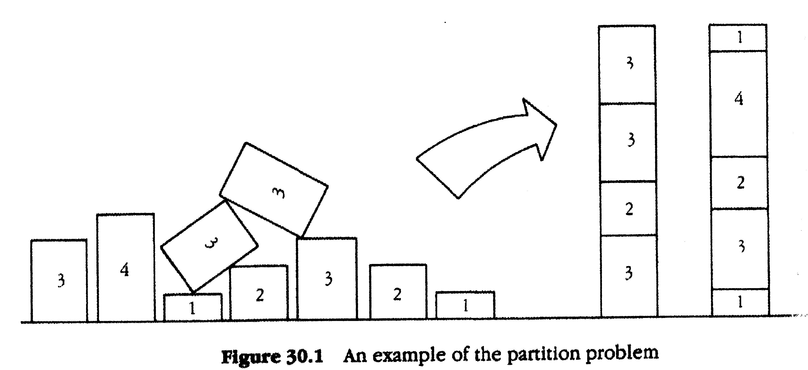

# **Partition Problem**

## Introduction

In number theory and computer science, the **partition problem**, or number partitioning, is the task of deciding whether a given multiset S of positive integers can be partitioned into two subsets S1 and S2 such that the sum of the numbers in S1 equals the sum of the numbers in S2. Although the partition problem is NP-complete, there is a pseudo-polynomial time dynamic programming solution, and there are heuristics that solve the problem in many instances, either optimally or approximately. For this reason, it has been called "the easiest hard problem".

The aim of this project is to **prove that this problem is NP-Complete**.

   
  

